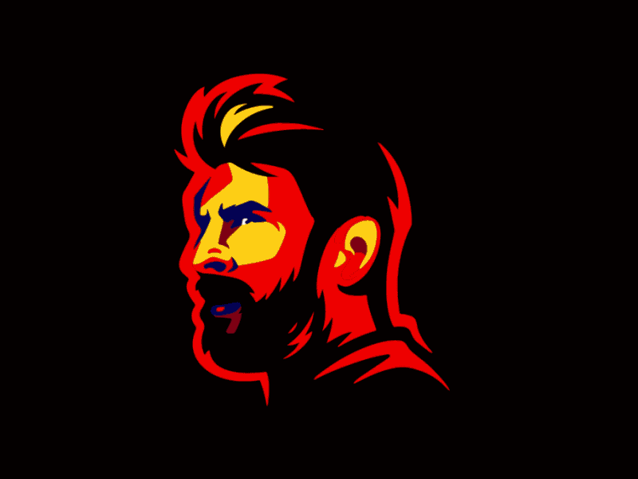

<!--                       About Me                        -->

<div align="center">

<a href="https://www.linkedin.com/in/ismael-karki-manaay-9675213b4">
</a>
<a href="https://instagram.com/vibes_ikm">
</a>
<a href="https://facebook.com/vibesikm">
</a>

<br/>

<br/>


</div>

<br/>

<table>
<tr>

<td width="56%" valign="top">

<h2>⚙️ profileConfig.js</h2>

```typescript
const profile = {
  name: "Ismael Karki Manaay",
  location: "Nepal 🇳🇵",

  education: [
    "BE, Computer Engineering",
    "9-12 degree in Civil Engineering",
  ],

  currentlyLearning: [
    "Next.js",
    "Go",
    "PostgreSQL",
  ],

  engineeringMindset: "Create. Read. Update. Delete.",
};
```
</td>

<td width="44%" align="center" valign="middle">




</td>

</tr>
</table>

<div align="center">


</div>

<!--                    PAC-MAN ARCADE GAME                     -->

<div align="center">
<h2> 🛠️ Builder Arcade</h2> 
  
<p>
Watch Pac-Man Journey
</p>

<br/>

<picture>
  <source
    media="(prefers-color-scheme: dark)"
    srcset="https://github.com/IKM-Products/IKM-Products/blob/output/pacman-contribution-graph-dark.svg?raw=true"
  />
  <source
    media="(prefers-color-scheme: light)"
    srcset="https://github.com/IKM-Products/IKM-Products/blob/output/pacman-contribution-graph.svg?raw=true"
  />
  
</picture>

<br/>


</div>

<!--                       Languages & Tools                        -->

<div align="center">
<h2>🔧 Languages & Tools</h2>
</div>

<table>
<tr>
<td width="75%" valign="top">


</td>

<td width="25%" align="center" valign="top">


</td>
</tr>
</table>
<br/>

<div align="center">


</div>
